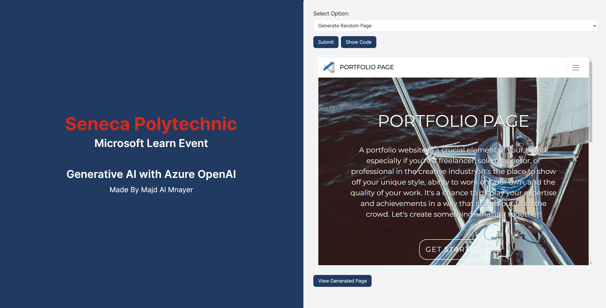
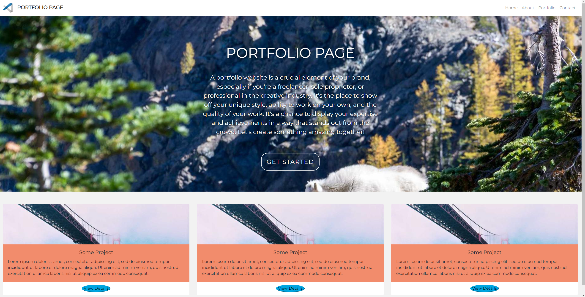

# Microsoft Azure OpenAI Generative AI Demonstration

This project's sole goal is to demonstrate the power of generative AI and the many things we can accomplish with it.

Thank you Microsoft Learn for providing me with the tools to create this amazing project!

You can view a video demonstrating this project [Here](https://www.youtube.com/watch?v=Lh-9pOkQxBo)

## Technologies Used

### Back-End

I used Microsoft Azure's OpenAI services in the making of this project.

    - Node.js
    - Express
    - JavaScript

### Front-End

    - Next.js
    - JavaScript

## Chat API

This api is relatively simple, it is meant for communication with a gpt-model, similar to ChatGPT. You can talk to it, ask it questions, ask it to write cool poems. However, Whatever you do, do not ask it to tell you the answer to life, the universe, and everything!

## Generate Element API

This api has one job, generate cool looking designs for you to use in your projects! You can ask it to generate anything you can think of, and it will return it in html/css format, also, you can see and use the code!

## Generate Random Page API

Arguably the most complex api here. This is responsible for returning a completely random html page. The bot adheres to the best UI/UX design principles!

You can also see the code that is returned and use it in your projects!

## How To use

In order to use this project, you will need access to Microsoft Azure's OpenAI services.

Additionally, you will need the following environment variables for your backend:

    - AZURE_OPENAI_KEY=
    - AZURE_OPENAI_ENDPOINT=
    - OPENAI_DEPLOYMENT_NAME=

When you have everything listed above, simply `npm i` in both the front-end and the back-end, then `npm run dev` in both the front-end and the back-end.

Important: `Make sure you are running your back-end on port 8080`
